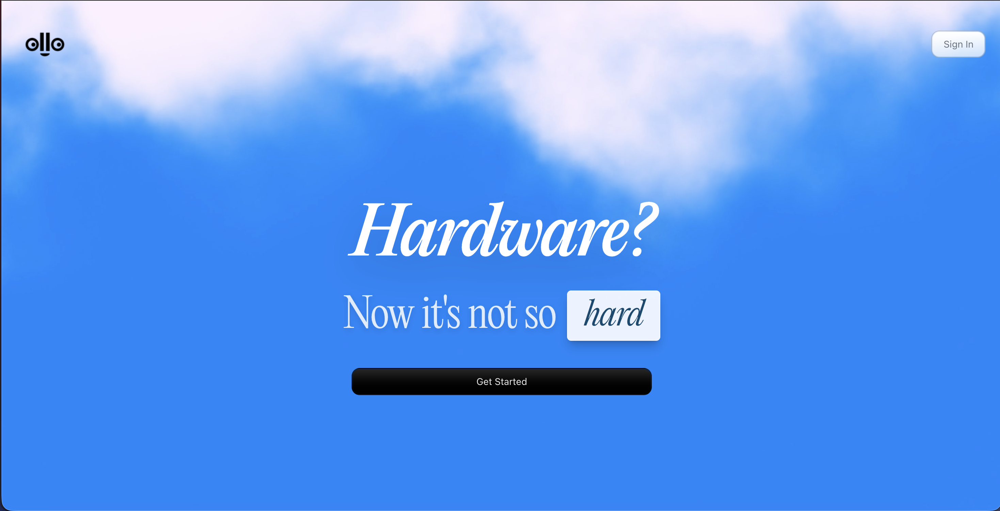

# ollo 🔧 ⚡

I made ollo becuase of the struggles I had when I started doing hardware. I am making ollo to smoothen out that experience and help beginners with their hardware imaginations.

---



## Features
⏳ = Coming soon

- **🤖 AI-Powered Project Planning** - Answer relevant questions to get tailored project guidance
- **⏳ 📦 Smart Parts Recommendations** - Automated component sourcing from major suppliers
- **🎯 Context-Aware AI** - Remembers your project details for personalized suggestions
- **📄 Datasheets & Documentation** - Automatic datasheet fetching and educational resources for components
- **⏳ ⚡ Real-time Updates** - Live project status and progress tracking

---

## Tech Stack

- **Framework:** Next.js 16 (App Router, React 19, Turbopack)
- **UI/Styling:** Tailwind CSS 4, Radix UI, Motion
- **Authentication:** Clerk
- **Database:** Supabase
- **AI:** OpenAI GPT-5 Nano, Google Gemini 2.5 Flash (via AI SDK)
- **Type Safety:** TypeScript 5

---

## Getting Started

### Prerequisites

- Node.js 20+ 
- npm/yarn/pnpm/bun
- Clerk account
- Supabase project
- OpenAI API key

### Installation

1. Clone the repository:
```bash
git clone https://github.com/madebyshaurya/ollo.git
cd ollo
```

2. Install dependencies:
```bash
npm install
```

3. Set up environment variables:
```bash
cp .env.example .env.local
```

Fill in your credentials:
```env
NEXT_PUBLIC_CLERK_PUBLISHABLE_KEY=
CLERK_SECRET_KEY=
CLERK_WEBHOOK_SECRET=
NEXT_PUBLIC_SUPABASE_URL=
SUPABASE_SERVICE_ROLE_KEY=
OPENAI_API_KEY=
NEXT_PUBLIC_APP_URL=
NEXAR_CLIENT_ID=                     # Optional: Nexar/Octopart client ID for datasheet fetching
NEXAR_CLIENT_SECRET=                 # Optional: Nexar/Octopart client secret
```

1. Run the development server:
```bash
npm run dev
```

Open [http://localhost:3000](http://localhost:3000) to see the app.

---

## Project Structure

```
ollo/
├── app/                    # Next.js app directory
│   ├── api/               # API routes
│   ├── dashboard/         # Dashboard pages
│   └── page.tsx           # Landing page
├── components/            # React components
│   ├── ui/               # UI primitives
│   ├── dashboard/        # Dashboard-specific
│   └── settings/         # Settings components
├── lib/                   # Utilities & services
│   ├── actions/          # Server actions
│   ├── services/         # Business logic
│   └── utils/            # Helper functions
└── types/                 # TypeScript types
```


---

## Environment Variables

| Variable | Description |
|----------|-------------|
| `NEXT_PUBLIC_CLERK_PUBLISHABLE_KEY` | Clerk public key for authentication |
| `CLERK_SECRET_KEY` | Clerk secret key |
| `CLERK_WEBHOOK_SECRET` | Webhook signature verification |
| `NEXT_PUBLIC_SUPABASE_URL` | Supabase project URL |
| `SUPABASE_SERVICE_ROLE_KEY` | Supabase admin key |
| `OPENAI_API_KEY` | OpenAI API key |
| `NEXT_PUBLIC_APP_URL` | Application base URL |
| `NEXAR_CLIENT_ID` | Optional: Nexar/Octopart client ID for automatic datasheet fetching |
| `NEXAR_CLIENT_SECRET` | Optional: Nexar/Octopart client secret for automatic datasheet fetching |

---

## Scripts

```bash
npm run dev      # Start development server (Turbopack)
npm run build    # Build for production
npm run start    # Start production server
npm run lint     # Run ESLint
```

---

## Contributing

Contributions are welcome! Please feel free to submit a Pull Request.

## Contact

Built by [@madebyshaurya](https://x.com/madebyshaurya)

---

**Made with ❤️ & 🥤**
